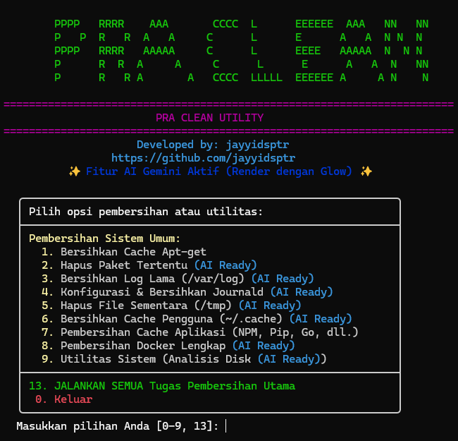

# PRA CLEAN Utility

PRA CLEAN Utility adalah skrip Bash interaktif untuk membantu membersihkan dan memantau server Linux berbasis Debian/Ubuntu. Skrip ini fokus pada pembersihan cache sistem, log, cache aplikasi, Docker, analisis disk, dan tinjauan log. Fitur Gemini AI tersedia opsional untuk menjelaskan risiko penghapusan paket, memberi saran optimasi disk, dan menganalisis potongan log.

**Dikembangkan oleh:** jayyidsptr

**GitHub:** https://github.com/jayyidsptr



## Fitur Utama

- **Menu interaktif berwarna** dengan konfirmasi pakai tombol panah/D-pad dan shortcut `y`/`n`.
- **Mode simulasi (`--dry-run`)** untuk melihat rencana aksi tanpa mengubah sistem.
- **Pembersihan APT**: `autoclean`, `clean`, dan `autoremove`.
- **Hapus paket tertentu** dengan validasi nama paket dan info AI opsional.
- **Pembersihan `/var/log`**: truncate log aktif dan hapus arsip log lama.
- **Konfigurasi journald**: ubah `SystemMaxUse`, `SystemMaxFileSize`, backup config, dan vacuum berdasarkan waktu/ukuran.
- **Pembersihan `/tmp` lebih aman**: default hanya item lebih tua dari jumlah hari tertentu; hapus semua butuh konfirmasi ganda.
- **Pembersihan cache pengguna**: default hanya cache lebih tua dari jumlah hari tertentu.
- **Pembersihan cache aplikasi**: NPM, Pip3, Go, Maven, dan Gradle.
- **Pembersihan Docker bertahap**: setiap operasi prune punya konfirmasi sendiri, termasuk volume.
- **Utilitas sistem**: analisis disk dan review log sistem.
- **Gemini AI opsional**: API key bisa dari env atau dimasukkan saat fitur AI dipakai.

## Persyaratan

- Debian/Ubuntu atau distro kompatibel dengan `apt-get` dan `systemd`.
- Bash.
- Hak akses root via `sudo`.
- Tool standar: `find`, `du`, `df`, `tail`, `sed`, `grep`, `getent`.
- Opsional sesuai fitur: `docker`, `npm`, `pip3`, `go`, `gradle`.
- Untuk AI: `curl`, `jq`, koneksi internet, dan API key Gemini.
- Opsional untuk tampilan AI: `glow`.

## Instalasi

```bash
git clone https://github.com/jayyidsptr/praClean.git
cd praClean
chmod +x praClean.sh
```

Dependensi AI opsional:

```bash
sudo apt update
sudo apt install curl jq -y
```

## Penggunaan

Jalankan normal:

```bash
sudo ./praClean.sh
```

Jalankan dengan Gemini API key dari environment:

```bash
export PRA_CLEAN_GEMINI_API_KEY="API_KEY_ANDA"
sudo -E ./praClean.sh
```

Mode simulasi tanpa menghapus/mengubah sistem:

```bash
sudo ./praClean.sh --dry-run
```

Konfirmasi aksi destruktif bisa dipilih dengan tombol `↑`/`↓` atau `←`/`→`, lalu `Enter`. Shortcut `y` dan `n` tetap tersedia.

Nonaktifkan AI sepenuhnya:

```bash
sudo ./praClean.sh --no-ai
```

Tampilkan bantuan:

```bash
./praClean.sh --help
```

## Catatan Keamanan

- Jalankan `--dry-run` dulu pada server penting.
- Backup data sebelum menjalankan pembersihan di server produksi.
- Docker volume prune dapat menghapus data volume tidak terpakai; skrip meminta konfirmasi khusus sebelum menjalankannya.
- Fitur AI hanya membantu analisis; keputusan akhir tetap di pengguna.
- API key Gemini tidak dikirim lewat query string; skrip memakai header `x-goog-api-key` via config sementara dengan permission `600`.

## Struktur Proyek

```text
.
├── assets/
│   └── screenshot_praclean.png
├── praClean.sh          # Skrip utama
├── praclean-bckp.sh     # Launcher kompatibilitas ke skrip utama
├── README.md
├── CHANGELOG.md
├── CONTRIBUTING.md
└── LICENSE
```

## Validasi Developer

```bash
bash -n praClean.sh
bash -n praclean-bckp.sh
```

Jika tersedia, jalankan juga:

```bash
shellcheck praClean.sh praclean-bckp.sh
```

## Kontribusi

Kontribusi bug report, ide fitur, dokumentasi, dan pull request diterima. Lihat `CONTRIBUTING.md`.

## Lisensi

MIT. Lihat `LICENSE`.
